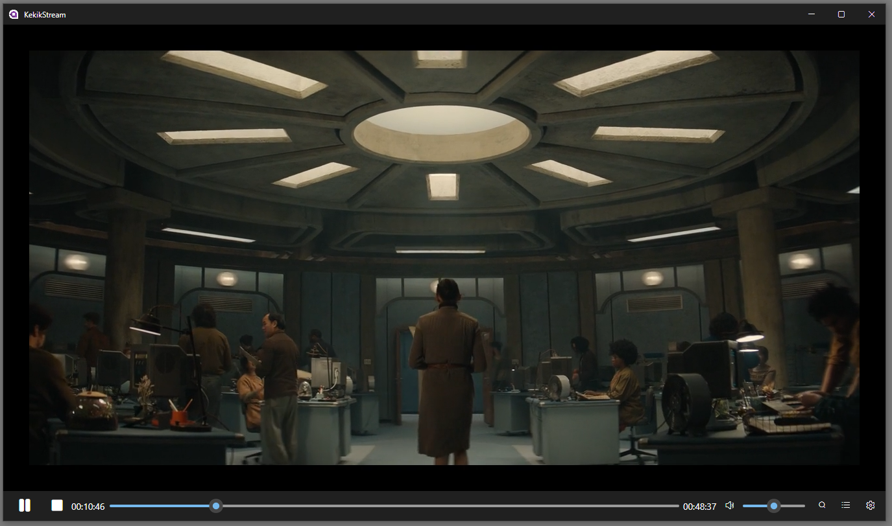

# KekikStream.Desktop

## Nedir? 

[KekikStream](https://github.com/keyiflerolsun/KekikStream) python konsol projesinin dotnet 9 Avalonia tabanlı crossplatform desktop kullanıcı dostu versiyonudur.

Bilgisayarda .Net 9  kurulu olması gerekir Python kurulu olmasına gerek yoktur. 
Yazılım ilk çalıştığında otomatik olarak kendi embedded Python ortamını (zaten bir Python kurulumu varsa ondan izole çalışır) ve pip üzerinden KekikStream kurulumunu yapacaktır.

Şimdilik sadece windows x64 için derlendi. Linux ve macos için artı çalışma yapmak gerekir.
Gömülü mpv player tarafında da altyazılar, dual videolar için ses seçimleri gibi çalışmalar yapılması lazım.

Uzun zamandır CloudStream, Kodi, MediaPortal gibi bir proje geliştirmek istiyordum ama vakit bulamıyordum.

Kodi harika bir proje, her işletim sisteminde çalışabilir fakat masaüstü kullanım deneyimi başarısız.
MediaPortal sadece Windows işletim sistemi için.
Cloudstream sadece Android işletim sistemi için.

Kafamdaki yapı tamamen Cloudstream gibi plugin tabanlı bir yazılım olsun, film dizi yayını yapan sitelerden eklentiler aracılığıyla veriler scrape edilsin kullanıcıya güzel bir deneyim sunulsun mantığıydı.

Cloudstream'i görüp inceledikten sonra adamlar yapmış abi dedim ve uğraşmaya gerek yok diye düşündüm ama işletim sistemi bağımlılığından dolayı tekrar isteğim arttı.

Aynı zamanda Cloudstream'e eklenti yapan KekikAkademi [@keyiflerolsun](https://github.com/keyiflerolsun) kardeşin başarılı işlerini görünce projemin plugin ksımını python ve dotnet tabanlı tasarlamaya karar verdim.

Uzun lafın kısası bu proje asıl projem için araştırma geliştirme deneme projesidir.

Teşekkürler:

+ [KekikStream](https://github.com/keyiflerolsun/KekikStream) 
+ [Avalonia](https://github.com/AvaloniaUI/Avalonia)
+ [LibMpv](https://github.com/homov/LibMpv)
+ [Pythonnet](https://github.com/pythonnet/pythonnet) 
+ [Python.Included](https://github.com/henon/Python.Included)
+ Ve daha niceleri... 

## Ekran Görüntüleri

